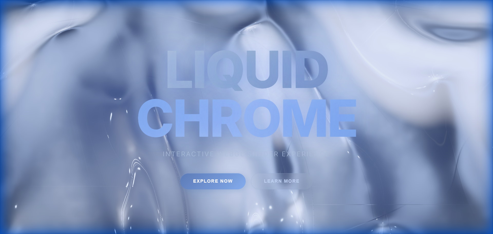

# 🌊 Liquid Chrome Hero

A stunning **liquid metal hero background** built with WebGL shaders — featuring premium Apple-style aesthetics with cold chrome finishes, anisotropic strip lighting, and deep shadows.



## ✨ Features

- **PBR Metallic Shading** — Physically-based rendering with GGX microfacet distribution
- **Anisotropic Strip Lights** — Elongated horizontal studio reflections like professional photography
- **Deep Cavity Shadows** — Strong contrast between convex ridges and concave valleys
- **Interactive Mouse Deformation** — Real-time surface ripples following cursor movement
- **Fresnel Edge Glow** — Metallic curvature highlighting on edges
- **Cold Chrome Palette** — Icy blue-silver finish with navy cavities

## 🚀 Quick Start

```bash
# Install dependencies
npm install

# Run development server
npm run dev
```

Visit `http://localhost:5173/` to see the effect.

## 🛠️ Tech Stack

- **Vue 3** — Component framework
- **Vite** — Build tool & dev server
- **WebGL** — Raw shader programming (GLSL)
- **PBR Shading** — GGX, Fresnel-Schlick, Smith geometry

## 📁 Project Structure

```
herobg-1/
├── LiquidChromeHero.vue   # Main WebGL shader component
├── src/
│   ├── App.vue            # Root component
│   └── main.js            # Vue entry point
├── index.html             # HTML template
├── vite.config.js         # Vite configuration
└── package.json           # Dependencies
```

## 🎨 Shader Features

| Feature | Description |
|---------|-------------|
| Macro Geometry | Multi-frequency sine wave folds |
| Micro Shimmer | 4-octave noise texture |
| Environment HDRI | Cold studio with strip softboxes |
| Anisotropic GGX | Stretched horizontal highlights |
| Directional Lighting | Upper-left key + lower-right rim |
| Tone Mapping | High-contrast S-curve compression |

## 📜 License

MIT

---

Made with 💙 by [Vann4799](https://github.com/Vann4799)
